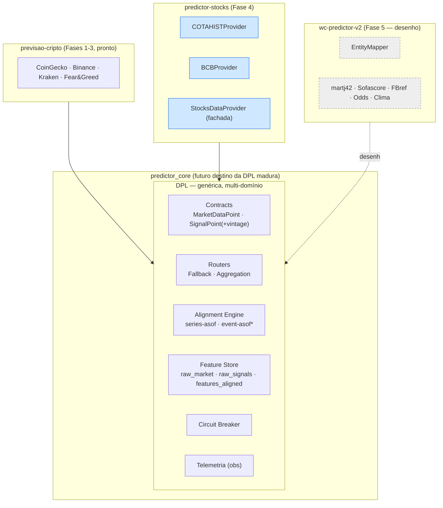
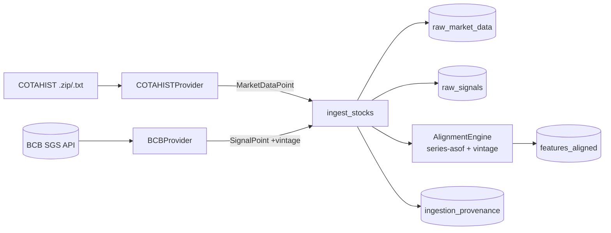
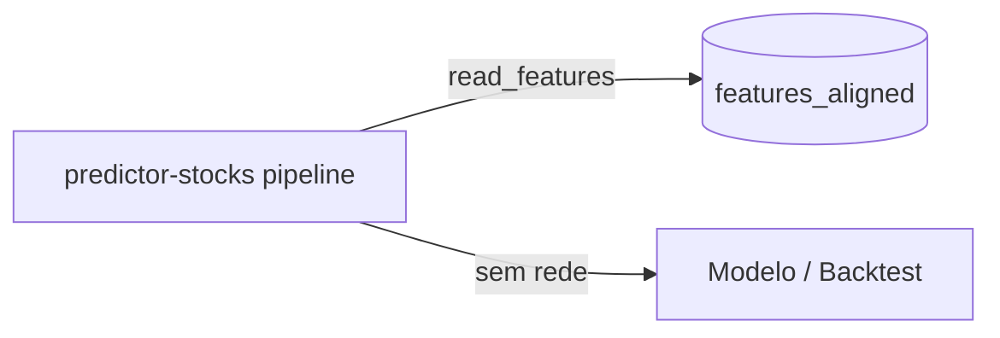
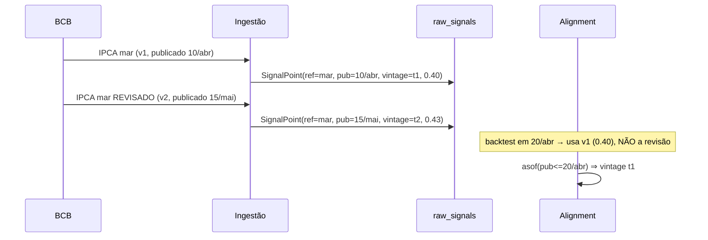
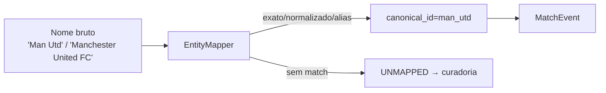

# Especificação Arquitetural — DPL Fases 4 e 5

> Nível: Staff/Principal. Escopo: estender a Data Provider Layer para **predictor-stocks**
> (Fase 4 — implementação imediata) e **wc-predictor-v2** (Fase 5 — apenas desenho).
> Documento irmão do [DOSSIE_PLATAFORMA.md](DOSSIE_PLATAFORMA.md). Responde na ordem
> obrigatória: revisão crítica → assunções → arquitetura → componentes → diagramas →
> documento arquitetural → plano → roadmap → backlog → riscos → ADRs → evoluções.

Classificação das recomendações: **[OBR]** obrigatória · **[REC]** recomendada · **[OPC]** opcional.

---

## 1. Revisão crítica da arquitetura existente

Avaliação de cada premissa **antes** de projetar. As Fases 0–3 estão implementadas em
`GarimpoInvestimentos/dpl/` (contracts, signals, router, aggregation, alignment,
feature_store, feature_engineering, circuit_breaker, facade, ingest, providers).

| # | Premissa | Veredito p/ Fases 4–5 | Risco | Trade-off / Ação |
|---|----------|----------------------|-------|------------------|
| P1 | Feature Store SQLite/Parquet | **Manter SQLite; Parquet vira REC, não fato** | Hoje só SQLite está implementado; Parquet é design-option do dossiê, **não existe em código**. Ações geram volumes pequenos (≈milhares de linhas/ativo) → SQLite sobra. | Não construir Parquet por antecipação (viola "Evolução por Demanda"). Promover a Parquet só quando um domínio exceder ~10⁷ linhas ou exigir leitura colunar (futebol event-level pode chegar lá). |
| P2 | Alignment Engine = Forward Fill | **Válida para stocks; insuficiente para a 1ª regra da Fase 5** | Forward fill cobre séries (preço diário, macro mensal). Mas **revisões históricas** (BCB revisa IPCA) e **eventos discretos** (partidas) não são "preencher para frente". | Stocks: reusar o engine atual + adicionar dimensão de **vintage/revisão** (ver ADR-008). Futebol: o engine precisa de modo **event-asof** (ADR-012), não forward-fill. |
| P3 | Circuit Breaker em memória/instância | **Válida agora; limitação conhecida** | Ingestão de stocks é single-process agendada → ok. Multi-instância continua em aberto. | Manter. Documentar que ingestão concorrente multi-processo exigiria estado compartilhado (Redis/tabela). **[OPC]** |
| P4 | Separação ingestão ↔ serving obrigatória | **Reforçar** | COTAHIST é arquivo grande (anual); BCB tem rate limit. Misturar com serving seria desastroso. | Manter rígida. Stocks reforça o caso: ingestão pesada e rara, serving leve e frequente. |
| P5 | MarketDataPoint mínimo e imutável | **Manter para preço; criar 2º contrato para macro** | OHLCV não modela uma série macro (Selic = 1 valor escalar com data de referência ≠ data de publicação ≠ vintage). Forçar OHLCV em macro seria poluição. | `SignalPoint` **já existe** e modela "valor escalar + published_at" — **reutilizar** para BCB em vez de criar tipo novo (Reutilização antes de Generalização). Estender `SignalPoint` com `reference_date` e `vintage` (ADR-008). |

**Conclusões da revisão (todas [OBR] salvo indicação):**

1. **Não criar `Parquet` agora** — YAGNI; SQLite atende. *(simplicidade)*
2. **Reutilizar `SignalPoint` para dados macro** (BCB) em vez de um novo envelope — ele já carrega `value`/`published_at`. Estender com `reference_date` + `vintage`. *(reutilização, baixo acoplamento)*
3. **Adicionar suporte a vintage/revisão** ao Alignment Engine (point-in-time correto): macro brasileiro é revisado, e usar o valor revisado num backtest é lookahead silencioso. **Risco alto se ignorado.**
4. **O Alignment Engine atual NÃO serve para a Fase 5** sem um modo event-asof — registrar como ADR-012, sem implementar agora.
5. **Não promover a DPL ao `predictor_core` ainda** — Fase 4 é o 2º domínio; ao fim dela teremos 2 casos concretos (cripto+ações) → aí sim a promoção satisfaz "Evolução por Demanda" (ADR-009).

---

## 2. Assunções

Declaradas explicitamente (não verificadas no código; a confirmar com o desenvolvedor):

| ID | Assunção | Impacto se falsa |
|----|----------|------------------|
| A1 | COTAHIST é consumido como arquivo anual de layout posicional fixo (registro tipo 01, 99 bytes/linha histórica B3) baixável manualmente ou por URL estável. | Parser muda; ingestão por URL pode exigir scraping. |
| A2 | O ambiente corporativo (EDR/TLS) **permite** baixar o ZIP do COTAHIST e acessar a API SGS do BCB (`api.bcb.gov.br/dados/serie`). | Se bloqueado, ingestão de stocks precisa de bootstrap manual de arquivos (igual ao racional do vendoring). |
| A3 | O domínio `predictor-stocks` é um repositório/worktree separado que **vendoriza** a DPL (hoje em `GarimpoInvestimentos/dpl/`) ou consome a versão promovida ao core. | Define se Fase 4 importa de `predictor_core.dpl` ou vendoriza. |
| A4 | Após o refactor `core/→store/`, os utilitários de logging/paths estarão em `store/`; a DPL não depende deles (depende só de `predictor_core`). | Rebase da branch atual ajusta só `main.py`. |
| A5 | Para a Fase 5, as fontes (martj42 CSV, Sofascore, FBref) permanecem read-only e o domínio segue PARKED — desenho apenas. | Nenhum (é planejamento). |
| A6 | "Zero lookahead" exige **point-in-time** para macro: o backtest em data T só pode ver o valor de IPCA conhecido publicamente em T (não a revisão posterior). | Sem isso, resultados de backtest de stocks são otimisticamente enviesados. |
| A7 | Frequências-alvo da Fase 4: preço **diário** (COTAHIST), macro **diário/mensal** (Selic diária, IPCA mensal). Trimestral (PIB) é [OPC]. | Define colunas/staleness do alignment. |

---

## 3. Arquitetura geral

Princípio diretor: **a DPL não muda de forma**; os novos domínios plugam conectores e
reutilizam Router, Alignment Engine, Feature Store, Circuit Breaker e telemetria. O que é
**genérico** sobe para a DPL; o que é **regra de negócio** (parser COTAHIST, mapa de
entidades de futebol) fica no domínio.

**Decisões estruturais:**

- **[OBR]** Conectores concretos vivem no domínio; **contratos e orquestração** na DPL.
- **[OBR]** `SignalPoint` é o envelope de toda série não-OHLCV (macro, sentimento, rankings). Estendido com `reference_date` e `vintage` para point-in-time.
- **[REC]** Ao concluir a Fase 4 (2º domínio), promover a DPL para `predictor_core` (ADR-009).
- **[OBR]** Nenhum domínio importa outro; futebol não conhece stocks.

---

## 4. Componentes

Cada componente segue a grade de 19 pontos (condensada em prosa+tabela por densidade).

### 4.1 Fase 4 — `COTAHISTProvider` **[OBR]**

1. **Objetivo:** traduzir o arquivo COTAHIST da B3 (cotações históricas de ações) em `MarketDataPoint` OHLCV diário.
2. **Responsabilidades:** localizar/abrir o arquivo (ZIP/TXT), parsear o layout posicional, validar, deduplicar, emitir candles, suportar ingestão incremental.
3. **Entradas:** caminho do arquivo COTAHIST (ano), filtro de tickers, intervalo de datas.
4. **Saídas:** `list[MarketDataPoint]` (interval="1d", source="cotahist", `published_at` = data do pregão + defasagem de disponibilização — ver nota temporal).
5. **Interfaces:** implementa `DataProvider` (`fetch_ohlcv`, `health_check`). Adiciona `ingest_file(path)` específico (parsing local não cabe em `fetch_ohlcv` semanticamente, mas exposto via método próprio chamado pela ingestão).
6. **Fluxo interno:** abrir → iterar linhas tipo `01` → fatiar campos por offset (data, ticker, BDI, abertura, máx, mín, fech, volume) → escalar preços (COTAHIST guarda preço ×100, sem ponto decimal) → montar `MarketDataPoint` → validar → retornar.
7. **Dependências:** stdlib (`zipfile`, `struct`/slicing), `predictor_core` (sem rede — arquivo local). **Não** usa CCXT.
8. **Cache:** o próprio arquivo é imutável (histórico fechado); cache = a `raw_market_data` materializada. Reprocessar é idempotente (upsert por PK).
9. **Versionamento:** `source="cotahist"`, mais um campo de metadados `file_sha256` (auditoria) gravado em tabela de proveniência (ver §4.5).
10. **Tratamento de erros:** linha malformada → registrar e pular (não abortar o lote); arquivo ausente/corrompido → exceção (sem dado não há ingestão). Campos fora de faixa (preço negativo) → descartar a linha + telemetria.
11–14. **Observabilidade:** logs por arquivo; telemetria `data.ingested` (n_linhas, n_descartadas, n_tickers), `data.parse_error` (linha, motivo). Métricas: taxa de descarte, candles/seg.
15. **Testes unitários:** parser com fixtures sintéticas (linha válida, preço ×100, ticker com espaço, linha truncada, BDI não-acionário filtrado).
16. **Integração:** ingestão completa de um mini-arquivo → `raw_market_data` → `read_raw`.
17. **Regressão:** SHA do arquivo + golden output (candles esperados) congelado.
18. **Aceite:** dado um COTAHIST de N pregões, materializa N candios/ticker sem lookahead e idempotente.
19. **Evoluções:** suporte a opções/índices (outros BDIs); ingestão de arquivo diário (não só anual).

> **Nota temporal (anti-lookahead) [OBR]:** o COTAHIST de um pregão D fica disponível **após** o fechamento. `published_at = D 18:00 BRT` (ou política configurável), **não** `D 00:00`. Backtest em D não pode usar o candle de D antes do fechamento.

### 4.2 Fase 4 — `BCBProvider` **[OBR]**

1. **Objetivo:** ingerir séries macroeconômicas do BCB (SGS): Selic (diária), IPCA (mensal), câmbio etc., como `SignalPoint`.
2. **Responsabilidades:** chamar a API SGS, parsear JSON, mapear `data` (referência) vs disponibilidade, capturar **revisões/vintage**, retries, circuit breaking.
3. **Entradas:** código da série SGS (ex.: 11=Selic, 433=IPCA), intervalo de datas.
4. **Saídas:** `list[SignalPoint]` com `reference_date`, `published_at`, `vintage`, `value`, `source="bcb_sgs"`, `name=f"sgs_{codigo}"`.
5. **Interfaces:** implementa `SignalProvider` (`fetch`). Reusa `predictor_core.net` (httpx + retry) e `CircuitBreaker`.
6. **Fluxo interno:** montar URL (`/dados/serie/bcdata.sgs.{cod}/dados?formato=json&dataInicial..`) → GET com retry → parsear `[{data, valor}]` → `reference_date`=data; `published_at`=data+lag de divulgação (ver nota); `vintage`=timestamp de coleta → `SignalPoint`.
7. **Dependências:** `predictor_core.net`, `CircuitBreaker`, `SignalPoint`.
8. **Cache:** série materializada em `raw_signals`; coleta incremental por data. Mesma (série, reference_date) com `vintage` novo = nova linha (preserva histórico de revisões).
9. **Versionamento:** `vintage` (quando foi coletado) distingue revisões; `published_at` (quando ficou público) governa o alinhamento point-in-time.
10. **Erros:** 4xx (série inexistente) → exceção não-transitória; 5xx/timeout → retry; falhas repetidas → circuito abre.
11–14. **Observabilidade:** telemetria `data.ingested`, `circuit.transition`, `data.signal_revised` (quando um valor de uma reference_date muda entre vintages). Métricas: latência SGS, nº de revisões detectadas.
15. **Unitários:** parser de JSON SGS, cálculo de `published_at` com lag, detecção de revisão (mesmo reference_date, valor diferente).
16. **Integração:** mock httpx → ingestão → `raw_signals` com 2 vintages.
17. **Regressão:** golden de uma janela conhecida da Selic.
18. **Aceite:** série materializada com vintage; backtest point-in-time não enxerga revisão futura.
19. **Evoluções:** outras fontes macro (IBGE/SIDRA), webhooks de divulgação.

> **Nota temporal [OBR]:** IPCA de referência "mês M" é divulgado ~no início de M+1. `published_at` = data de divulgação, não fim do mês de referência. **Revisões**: o BCB pode revisar; o backtest deve usar o vintage vigente em cada data (point-in-time), não o valor final.

### 4.3 Fase 4 — `StocksDataProvider` (fachada) **[OBR]**

| Aspecto | Detalhe |
|---|---|
| Objetivo | Interface única do domínio stocks; esconde COTAHIST+BCB e a política. |
| Composição | Reusa `FallbackRouter`/`AggregationRouter` para preço (se houver 2ª fonte de preço, ex.: Yahoo) e expõe `SignalProvider`s macro separadamente. |
| Roteamento | Preço: fallback (COTAHIST primário, fonte online secundária [OPC]). Macro: sem agregação (fonte única canônica = BCB). |
| Fallback | COTAHIST é canônico/imutável → fallback raramente aciona; existe para janelas recentes ainda não no arquivo anual. |
| Agregação | **Não recomendada** para macro (fonte oficial única). Aplicável só se houver múltiplas fontes de preço. |
| Sincronização | Orquestrada pela camada de ingestão (`ingest_stocks`), não pela fachada. |
| Extensão | Novos provedores macro (IBGE) plugam como `SignalProvider`; novas bolsas como `DataProvider`. |
| 19-grade | Telemetria herdada do Router; testes via fakes (idêntico ao padrão cripto). |

### 4.4 Fase 4 — Alignment Engine (séries diárias/mensais + vintage) **[OBR]**

| Aspecto | Detalhe |
|---|---|
| Objetivo | Alinhar preço diário (grade) com macro de frequências heterogêneas (diária/mensal/trimestral) sem lookahead e com **point-in-time**. |
| Diárias | Selic diária: as-of por `published_at` (já suportado). |
| Mensais/Trimestrais | IPCA/PIB: forward-fill do último valor **público** até nova divulgação; `max_staleness` evita arrastar valor obsoleto por trimestres. |
| Zero lookahead | Regra atual `published_at <= candle.timestamp` **mantida**. |
| Revisões (vintage) | **Nova capacidade**: ao alinhar para a data T, escolher o `SignalPoint` com maior `published_at <= T` **e** o `vintage` vigente em T (não o último vintage). Implementado como filtro extra no as-of. |
| Eventos extraordinários | Feriados/circuit-breaker da bolsa: dias sem pregão simplesmente não geram candle (grade dirigida pelo preço). |
| Garantias | Determinístico; mesma entrada → mesma matriz. Testável com fixtures de revisão. |

> **Decisão [OBR]:** estender o `AlignmentEngine` com vintage é **aditivo** (sem vintage, comporta-se como hoje) → preserva compatibilidade com cripto (ADR-008).

### 4.5 Fase 4 — Tabela de proveniência (nova) **[REC]**

Para auditabilidade ponta-a-ponta (origem→feature→modelo): tabela `ingestion_provenance(run_id, source, symbol_or_series, file_sha256_or_url, vintage, n_rows, ingested_at, code_version)`. Liga cada linha materializada à sua origem e versão de código.

### 4.6 Fase 5 — `EntityMapper` **[OBR para o desenho]**

| Aspecto | Detalhe |
|---|---|
| Objetivo | Normalizar entidades (times, jogadores, estádios) entre martj42, Sofascore, FBref via tabela canônica DE/PARA. |
| Responsabilidades | Resolver alias → `canonical_id`; sinalizar não-mapeados; nunca adivinhar silenciosamente. |
| Entradas | `(source, raw_name, entity_type)`. |
| Saídas | `canonical_id` + confiança; ou `UNMAPPED` (com telemetria, exige curadoria humana). |
| Fluxo | lookup exato → normalização (lower/strip/acentos) → tabela de alias → fuzzy **somente como sugestão** (nunca auto-aplicado). |
| Persistência | Tabela `entity_canonical(canonical_id, type, display_name)` + `entity_alias(source, raw_name, canonical_id, confidence, curated_by)`. |
| Integração | Conectores de futebol chamam o mapper antes de emitir qualquer evento; `canonical_id` é a chave de junção. |
| Erros | `UNMAPPED` bloqueia ingestão daquele registro (não cria entidade fantasma). |
| Versionamento | A tabela DE/PARA é versionada (cada alteração tem `curated_by`/timestamp). |
| Testes | alias conhecido, acento, time homônimo, jogador transferido, não-mapeado. |
| Aceite | 100% dos eventos ingeridos têm `canonical_id`; nenhum auto-mapeamento por fuzzy. |

> **Risco-chave [OBR]:** mapeamento errado é o pior bug de futebol (junta estatística do time errado). Fuzzy só sugere; curadoria humana confirma.

### 4.7 Fase 5 — Providers de futebol (desenho)

`martj42Provider` (resultados históricos, CSV), `SofascoreProvider` (estatísticas/escalações/odds), `FBrefProvider` (estatísticas avançadas), e opcionais: odds, clima, calendário, lesões, rankings. Todos passam pelo `EntityMapper`; todos emitem um novo envelope `MatchEvent`/`MatchObservation` (ver §4.8) — **não** `MarketDataPoint` (futebol não é OHLCV).

### 4.8 Fase 5 — Alignment Engine para eventos discretos (desenho) **[OBR para o desenho]**

| Aspecto | Detalhe |
|---|---|
| Objetivo | Montar, para cada partida P em `kickoff(P)`, o vetor de features usando **apenas** informação pública antes do kickoff. |
| Pré-jogo | Escalações, odds, rankings, clima previsto, forma recente — cada um com `published_at < kickoff`. |
| Pós-jogo | Resultado/estatísticas: `published_at > kickoff` → **só** podem alimentar features de partidas **futuras** (nunca a própria nem anteriores). |
| Vazamento | Junção as-of por `published_at` contra `kickoff`; estatística de um jogo só entra como histórico de jogos subsequentes. |
| Retroativas | Correções de súmula (cartão revisto) entram com novo `published_at`/vintage; point-in-time igual ao macro. |
| Auditoria | Cada feature de partida carrega o conjunto de `(source, published_at)` que a originou. |

> O `AlignmentEngine` atual é **series-asof** (grade temporal contínua). Futebol exige **event-asof** (grade = eventos discretos com janelas pré/pós). É um **modo novo**, não um ajuste — ADR-012.

---

## 5. Diagramas

### 5.1 Ingestão Fase 4 (stocks)

### 5.2 Serving (idêntico cripto — offline)

### 5.3 Sequência point-in-time (revisão de IPCA)

### 5.4 Fluxo de entidades Fase 5

---

## 6. Documento Arquitetural (síntese)

- **Visão geral:** uma DPL, N domínios. Stocks reusa 100% da orquestração; adiciona 2 conectores e estende contratos/alignment de forma aditiva. Futebol introduz um eixo novo (eventos discretos) que exige um modo de alinhamento adicional — desenhado, não implementado.
- **Contratos:** `MarketDataPoint` (OHLCV, inalterado), `SignalPoint` **estendido** (`reference_date`, `vintage`), novo `MatchObservation` (Fase 5).
- **Componentes novos:** COTAHISTProvider, BCBProvider, StocksDataProvider, ingestão de stocks, tabela de proveniência (F4); EntityMapper, providers de futebol, modo event-asof (F5, desenho).
- **Fluxos:** ingestão pesada/rara → materialização → serving offline (inalterado).
- **Justificativas:** ver ADRs §11.

---

## 7. Plano de Implementação (Fase 4 prioritária; Fase 5 só planejamento)

| Milestone | Entregा | Dependências | Esforço | Prioridade | Complexidade |
|-----------|--------|--------------|---------|-----------|--------------|
| M0 | Rebase da branch DPL pós `core/→store/`; suíte verde | refactor commitado | S | P0 | Baixa |
| M1 | Estender `SignalPoint` (reference_date, vintage) — aditivo, retrocompat | M0 | S | P0 | Baixa |
| M2 | `COTAHISTProvider` + parser + testes | M1 | M | P0 | Média |
| M3 | `BCBProvider` (SGS) + retries/CB + vintage + testes | M1 | M | P0 | Média |
| M4 | `AlignmentEngine` vintage (point-in-time) + testes de revisão | M1 | M | P0 | Média-Alta |
| M5 | `StocksDataProvider` + `ingest_stocks` + `sources.json` stocks | M2,M3,M4 | M | P1 | Média |
| M6 | Tabela de proveniência + auditoria | M5 | S | P2 | Baixa |
| M7 | Backtest offline stocks + equivalência | M5 | M | P1 | Média |
| M8 | **[Fase 5]** Desenho EntityMapper + event-asof (só specs/ADRs) | — | M | P3 | Alta |

**Migração:** Fase 4 é aditiva — não quebra cripto. `SignalPoint` estendido com defaults (`vintage=None`) mantém o Fear&Greed funcionando. **Critérios de aceite globais:** suíte determinística verde; backtest stocks 100% offline; nenhum lookahead (testes de revisão e de `published_at`).

---

## 8. Roadmap

```mermaid
gantt
  dateFormat X
  axisFormat %s
  section Fase 4 (ativa)
  Rebase+SignalPoint       :0, 1
  COTAHIST+BCB             :1, 3
  Alignment vintage        :2, 4
  Fachada+Ingestão+Backtest:4, 6
  section Fase 5 (desenho)
  EntityMapper+event-asof specs :6, 8
```

Sequência: **M0→M1** desbloqueiam tudo. M2/M3 paralelizáveis. M4 é o coração anti-lookahead de stocks. M5–M7 fecham o domínio. M8 é desenho independente.

---

## 9. Backlog

| ID | Item | Fase | Prioridade | Compl. | Aceite |
|----|------|------|-----------|--------|--------|
| B1 | Estender `SignalPoint` (reference_date, vintage) | 4 | P0 | Baixa | Fear&Greed segue verde; novos campos opcionais |
| B2 | `COTAHISTProvider` parser posicional + escala ×100 | 4 | P0 | Média | Golden de mini-arquivo bate |
| B3 | Filtro de BDI (só ações à vista) | 4 | P0 | Baixa | Opções/índices excluídos |
| B4 | `published_at` pós-fechamento do pregão | 4 | P0 | Baixa | Backtest em D não vê D antes do close |
| B5 | `BCBProvider` SGS + retry + CB | 4 | P0 | Média | Mock 5xx→retry; 4xx→erro |
| B6 | Detecção/persistência de revisões (vintage) | 4 | P0 | Média | 2 vintages do mesmo ref_date coexistem |
| B7 | `AlignmentEngine` point-in-time por vintage | 4 | P0 | Média-Alta | Teste de revisão (§5.3) passa |
| B8 | `StocksDataProvider` + `ingest_stocks` | 4 | P1 | Média | Ingestão fim-a-fim materializa |
| B9 | Tabela `ingestion_provenance` | 4 | P2 | Baixa | Cada linha rastreável à origem+SHA |
| B10 | Backtest offline stocks | 4 | P1 | Média | Roda sem rede, reprodutível |
| B11 | **Desenho** EntityMapper + tabelas DE/PARA | 5 | P3 | Alta | Specs + ADR aprovados |
| B12 | **Desenho** modo event-asof | 5 | P3 | Alta | ADR-012 aprovado |
| B13 | Dashboard de telemetria (transversal) | 4/5 | P3 | Média | Lê eventos JSONL |

---

## 10. Riscos

| Risco | Prob. | Impacto | Mitigação | Severidade |
|-------|-------|---------|-----------|-----------|
| Lookahead por usar valor macro revisado | Alta | Alto | Point-in-time por vintage (B6/B7); testes de revisão | **Crítico** |
| Layout COTAHIST mal interpretado (offsets/escala) | Média | Alto | Golden tests; validação de faixas; SHA do arquivo | Alto |
| Ambiente bloqueia SGS/COTAHIST (TLS/EDR) | Média | Médio | Ingestão por arquivo manual; degradação graciosa | Médio |
| Mapeamento de entidade errado (Fase 5) | Alta | Alto | Fuzzy só sugere; curadoria humana; bloquear UNMAPPED | Alto (futuro) |
| Reuso indevido de `MarketDataPoint` para macro | Baixa | Médio | Usar `SignalPoint` (decisão §1) | Baixo |
| Overengineering (Parquet/multi-instância prematuros) | Média | Médio | YAGNI; só com 2º caso concreto | Médio |
| Drift do `published_at` (lag de divulgação errado) | Média | Alto | Lag configurável por série; auditoria | Alto |

---

## 11. ADRs

### ADR-007 — `SignalPoint` como envelope de dados macro (não novo tipo) **[OBR]**
- **Contexto:** BCB entrega séries escalares com data de referência/publicação/revisão.
- **Alternativas:** (a) novo `MacroDataPoint`; (b) reusar `SignalPoint`; (c) forçar `MarketDataPoint`.
- **Decisão:** (b). `SignalPoint` já modela valor escalar + `published_at`.
- **Consequências:** reuso máximo, baixo acoplamento; precisa de extensão (ADR-008). **Riscos:** semântica "signal" vs "macro" — mitigado por `name`/`source` claros.

### ADR-008 — Vintage/point-in-time no `SignalPoint` e Alignment **[OBR]**
- **Contexto:** macro brasileiro é revisado; backtest precisa do valor conhecido na época.
- **Alternativas:** ignorar revisões (lookahead); tabela separada de vintages; campo `vintage` no `SignalPoint` + filtro as-of.
- **Decisão:** campo `vintage` + `reference_date`; alinhamento escolhe o vintage vigente. **Aditivo** (default `None` = comportamento atual).
- **Consequências:** zero lookahead em macro; compat retroativa com cripto. **Risco:** complexidade do as-of — mitigado por testes (§5.3).

### ADR-009 — Promover a DPL ao `predictor_core` após a Fase 4 **[REC]**
- **Contexto:** "Evolução por Demanda" pede ≥2 casos concretos. Fase 4 é o 2º.
- **Decisão:** ao concluir stocks, promover a DPL (hoje em `GarimpoInvestimentos/dpl/`) ao core via vendoring + manifesto SHA256.
- **Consequências:** stocks e cripto consomem a mesma DPL versionada. **Risco:** sincronização — mitigado pelo `sync_core.py` existente.

### ADR-010 — Manter SQLite; não construir Parquet ainda **[OBR]**
- **Decisão:** SQLite atende stocks (volumes pequenos). Parquet só quando um domínio exigir leitura colunar/escala (provável em futebol event-level).
- **Consequências:** simplicidade. **Risco:** migração futura — baixo, a Feature Store abstrai o backend.

### ADR-011 — `published_at` derivado de lag de divulgação configurável **[OBR]**
- **Contexto:** COTAHIST (pós-close) e BCB (lag de dias) têm disponibilidade ≠ data de referência.
- **Decisão:** lag por fonte/série no `sources.json`; `published_at = reference + lag`.
- **Consequências:** anti-lookahead correto. **Risco:** lag mal calibrado — auditável e ajustável.

### ADR-012 — Modo `event-asof` no Alignment Engine (Fase 5, desenho) **[OBR p/ desenho]**
- **Contexto:** futebol é evento discreto, não série contínua; forward-fill não se aplica.
- **Decisão:** desenhar um 2º modo (event-asof) com janelas pré/pós-kickoff; **não** implementar agora.
- **Consequências:** mantém o engine atual intacto; futebol pluga quando sair do PARKED. **Risco:** sobreposição conceitual — isolar em estratégia separada.

### ADR-013 — EntityMapper com curadoria humana obrigatória **[OBR p/ desenho]**
- **Decisão:** fuzzy matching só sugere; `canonical_id` exige confirmação; `UNMAPPED` bloqueia ingestão.
- **Consequências:** evita o pior bug de futebol (estatística do time errado). **Risco:** custo de curadoria — aceitável dado o impacto.

---

## 12. Evoluções futuras

- **[OPC]** Parquet particionado + leitura colunar quando futebol event-level escalar.
- **[OPC]** Circuit Breaker com estado compartilhado (Redis/tabela) para ingestão multi-instância.
- **[REC]** Dashboard de telemetria consumindo o JSONL de `obs` (saúde de fontes, taxa de fallback, revisões macro).
- **[OPC]** Novos domínios (commodities, câmbio, renda fixa, eSports) reusando o mesmo padrão: 1 conector + contrato existente + alignment apropriado.
- **[REC]** Guia do arquiteto: "como adicionar um domínio/fonte em 5 passos".
- **[OPC]** Feature lineage explícito (origem→transformação→feature→modelo) sobre a tabela de proveniência (ADR-005 + §4.5).

---

---

## 13. Status de implementação (atualizado)

Implementado e testado **offline** na branch `claude/clever-mclean-16f6d8` (74 testes verdes).
Conectores de rede/arquivo trazem código completo + testes mockados, prontos para rodar
quando houver dados/rede.

| Item | Fase | Estado | Arquivo |
|------|------|--------|---------|
| `SignalPoint` + `reference_date`/`vintage` (aditivo) | 4 | ✅ | `dpl/signals.py` |
| `raw_signals` com vintage (revisões coexistem) + `read_signals` | 4 | ✅ | `dpl/feature_store.py` |
| Tabela `ingestion_provenance` + `write_provenance` | 4 | ✅ | `dpl/feature_store.py` |
| `COTAHISTProvider` + parser posicional (×100, filtros BDI/mercado) | 4 | ✅ (parser testado; arquivo real não disponível no ambiente) | `dpl/providers/cotahist.py` |
| `BCBProvider` (SGS) + retry + circuit breaker + vintage | 4 | ✅ (testado com httpx mockado; SGS não acessível no ambiente) | `dpl/providers/bcb.py` |
| `StocksDataProvider` (fachada) + `ingest_stocks` | 4 | ✅ (fim-a-fim offline) | `dpl/stocks.py` |
| Point-in-time via as-of de `published_at` (sem mudar o engine) | 4 | ✅ (teste de revisão do IPCA) | `dpl/alignment.py` (inalterado) |
| `MatchObservation` + `MatchDataProvider` | 5 | ✅ contrato | `dpl/events.py` |
| `EventAlignmentEngine` (event-asof, anti-vazamento pré-jogo) | 5 | ✅ | `dpl/events.py` |
| `EntityMapper` (DE/PARA curado, fuzzy só sugere) | 5 | ✅ | `dpl/entity_mapper.py` |
| `Martj42Provider` (CSV, canonicaliza, bloqueia não-mapeado) | 5 | ✅ | `dpl/providers/martj42.py` |
| Sofascore/FBref/Odds/Weather | 5 | ⏳ stubs com contrato testado offline (rede; PARKED) | `dpl/providers/football_stubs.py` |
| Migração aditiva 0005 (corrige C-04, idempotência) | 4 | ✅ | `dpl/migrations/` |
| ADR-014 modelo bitemporal (corrige C-05) | 4/5 | ✅ | `docs/ADR-014_modelo_bitemporal.md` |
| Auditoria arquitetural independente | — | ✅ | `docs/AUDITORIA_DPL.md` |

**Pendências documentadas (dependem de rede/dados reais — auditoria B-1/B-3):** validação
live da agregação (Binance+Kraken bloqueadas), golden de COTAHIST real, calibração do
`publish_lag` do BCB, promoção da DPL ao `predictor_core` (ADR-009), fechamento da Fase 0.

**Nota de fidelidade:** o `AlignmentEngine` de séries **não precisou de mudança** para
point-in-time — modelar cada revisão como um `SignalPoint` com `published_at` próprio faz
o as-of já escolher o vintage vigente (ADR-008 cumprido com código mais simples que o
previsto). O modo event-asof foi implementado como classe separada (`EventAlignmentEngine`),
sem tocar o engine de séries (ADR-012).

---

> **Recomendação final do arquiteto:** executar a Fase 4 na ordem M0→M7, tratando
> **vintage/point-in-time (ADR-008)** como o item de maior risco e maior valor — é o que
> separa um backtest de ações honesto de um enviesado. A Fase 5 está desenhada e
> bloqueada por curadoria de entidades (ADR-013) e pelo modo event-asof (ADR-012); ambos
> são aditivos e não exigem mudança no que já roda. Nada aqui altera as Fases 0–3.
